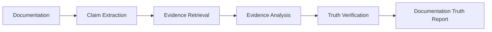

# NEXUS — Documentation Truth Engine

> **"Is your documentation actually telling the truth?"**

[](https://nexus-vedant.netlify.app/)
[]()
[]()

**NEXUS** is an evidence-based software documentation verification platform. It evaluates documentation claims against repository evidence and produces a traceable verification result backed by concrete references.

- **Live Application**: [https://nexus-vedant.netlify.app/](https://nexus-vedant.netlify.app/)
- **GitHub Repository**: [https://github.com/burgulvedant/Nexus](https://github.com/burgulvedant/Nexus)

---

## Why We Built NEXUS

Software development is fast-paced and continuous:
- Features are added and modified
- APIs and parameters change
- Configurations and environment variables evolve
- Codebases are refactored across releases

Documentation does not always evolve at the same pace. Over time, a critical gap emerges:

$$\text{What the documentation claims} \quad \neq \quad \text{What the software actually does}$$

This gap leads to developer confusion, broken integrations, and outdated onboarding guides. We built NEXUS to investigate whether technical documentation claims can be verified directly against evidence from the current codebase.

---

## The Problem

Technical documentation is full of functional and behavioral claims:
- **API Endpoints**: URLs, HTTP methods, parameters, return types, and status codes
- **Requirements & Setup**: Required runtime versions, database engines, and dependencies
- **Configuration**: Environment variables, default settings, and feature flags
- **Workflows**: Installation steps, execution procedures, and CLI commands

When software changes without corresponding doc updates, these claims drift silently.

The guiding question behind NEXUS is:

> **"Are the claims made by this software's documentation actually supported by the current software?"**

NEXUS treats this as an **evidence-verification problem** rather than a documentation-generation task. It does not rewrite or synthesize text; it verifies truthfulness using empirical repository facts.

---

## What NEXUS Does

NEXUS executes a deterministic, multi-stage verification pipeline:



### The Three Verification Verdicts

Every extracted claim is evaluated and assigned one of three transparent statuses:

| Verdict | Meaning | Description |
| :--- | :---: | :--- |
| 🟢 **VERIFIED** | **Supported** | Direct codebase evidence (source code, tests, configuration) corroborates the documented claim. |
| 🟡 **UNCERTAIN** | **Insufficient Evidence** | Available evidence is incomplete or ambiguous. NEXUS defaults to an honest *"I don't know"* rather than guessing. |
| 🔴 **CONTRADICTED** | **Discrepancy Found** | Concrete repository evidence directly conflicts with what the documentation asserts. |

---

## Verification in Action (Example)

Consider an illustrative documentation claim:

```markdown
> "GET /api/courses returns all available courses."
```

NEXUS investigates the repository across multiple evidence layers:
1. **Source Code**: Scans API router definitions and route handlers.
2. **Test Suites**: Inspects test cases and assertions verifying endpoint return shapes.
3. **Configuration & Schemas**: Examines API specs, data models, or route tables.

Based on what is discovered, NEXUS produces a verification verdict alongside supporting repository evidence and file/line references where available.

---

## Core Product Journey

1. **User Authentication**: Secure GitHub OAuth login with stateless cryptographic session management.
2. **Repository Registration**: Connect public GitHub repositories or select target branches.
3. **Automated Claim Extraction**: Parse documentation (`README.md`, `docs/`, API specs) to isolate discrete technical statements.
4. **Multi-Source Evidence Retrieval**: Inspect source files, test fixtures, schemas, and configuration declarations.
5. **Truth Verification Engine**: Cross-examine claims against evidence and assign verifiable verdicts.
6. **Documentation Truth Report**: Generate structured interactive dashboards, truth scores ($0–100$), and exportable Markdown summaries.

---

## Technical Stack & Architecture

- **Backend**: Python 3.14+, FastAPI, Uvicorn
- **Database & ORM**: PostgreSQL / Supabase Session Pooler (port 5432) with SQLAlchemy 2.0 (`QueuePool`, `pool_pre_ping=True`), SQLite for local development
- **Security & Authentication**: GitHub OAuth 2.0, Stateless HMAC-SHA256 CSRF tokens, JWT Bearer access tokens, Passlib / Bcrypt
- **Frontend**: React 19, TypeScript, Vite, Tailwind CSS
- **Testing**: Pytest, Starlette / HTTPX AsyncClient (38 automated backend tests passing)
- **Deployment**: Netlify (Frontend SPA), Render (Backend Web Service), Supabase (Managed PostgreSQL)

---

## Directory Structure

```text
.
├── backend/
│   ├── app/
│   │   ├── main.py             # FastAPI entrypoint & lifespan lifecycle
│   │   ├── core/               # App configuration, database session, security
│   │   ├── auth/               # GitHub OAuth router & token handlers
│   │   ├── users/              # User models, schemas, and persistence
│   │   ├── repositories/       # Repository registration & filtering
│   │   ├── analyses/           # Verification pipeline orchestration & status
│   │   ├── claims/             # Doc claim extraction & classification
│   │   ├── evidence/           # Codebase scanner & evidence engine
│   │   ├── verification/       # Truth scoring & verdict calculation
│   │   └── reports/            # Truth report generators (JSON & Markdown)
│   ├── tests/                  # Pytest test suite (38 passing tests)
│   └── requirements.txt        # Python backend dependencies
├── frontend/
│   ├── src/
│   │   ├── components/         # Landing page & Dashboard UI components
│   │   ├── api/                # API client & Markdown serializers
│   │   ├── App.tsx             # Root router & session manager
│   │   └── main.tsx            # React application entrypoint
│   ├── package.json            # Node dependencies & Vite build scripts
│   └── vite.config.ts          # Vite configuration
├── data/                       # Local SQLite storage for dev environment
├── ARCHITECTURE.md             # Technical architecture & schema guide
└── README.md                   # Project documentation
```

---

## Getting Started

### 1. Prerequisites
- **Python 3.14+**
- **Node.js 18+** & `npm`
- **Git**

### 2. Setup Environment
Clone the repository:
```bash
git clone https://github.com/burgulvedant/Nexus.git
cd Nexus
```

Create a `.env` file in the project root:
```bash
cp .env.example .env
```

### 3. Backend Setup
Create and activate a Python virtual environment:
```bash
python3 -m venv .venv
source .venv/bin/activate
pip install -r backend/requirements.txt
```

Start the FastAPI development server:
```bash
uvicorn backend.app.main:app --reload --port 8000
```
Interactive OpenAPI documentation will be available at `http://127.0.0.1:8000/docs`.

### 4. Frontend Setup
In a separate terminal window:
```bash
cd frontend
npm install
npm run dev
```
The frontend will be available at `http://localhost:5173/`.

---

## Running Tests

Run the complete backend automated test suite:
```bash
PYTHONPATH=. pytest backend/tests/ -v
```

**Test Status**: **38 PASSED, 0 FAILED** (100% pass rate).
